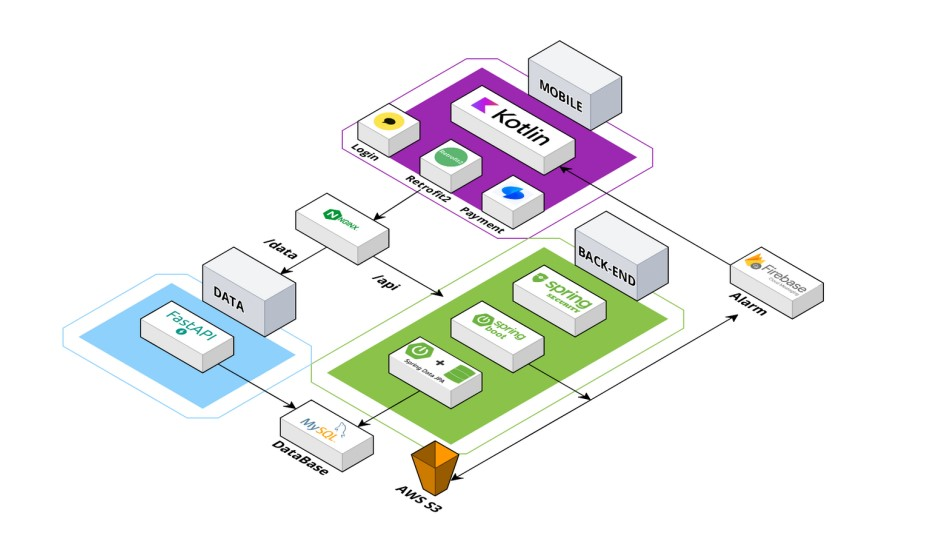
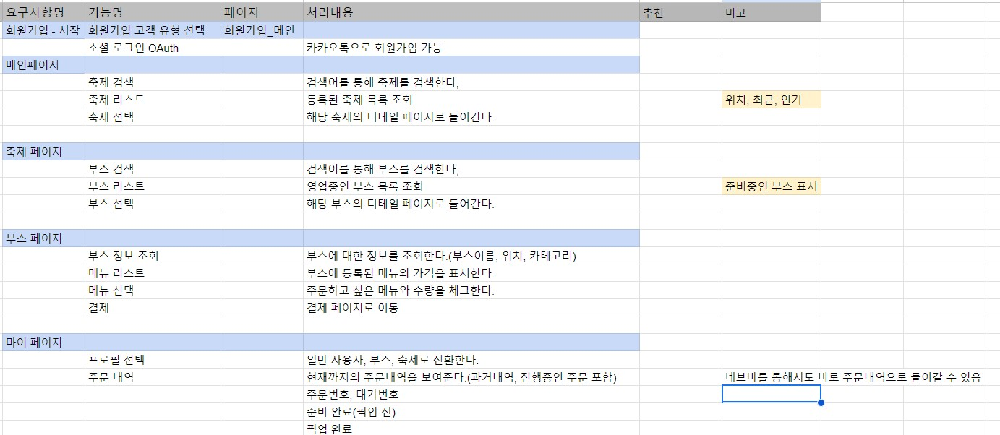
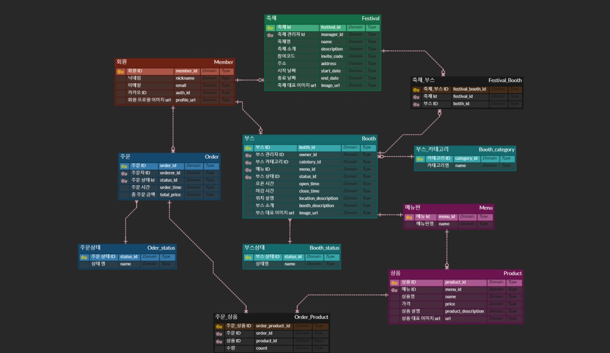
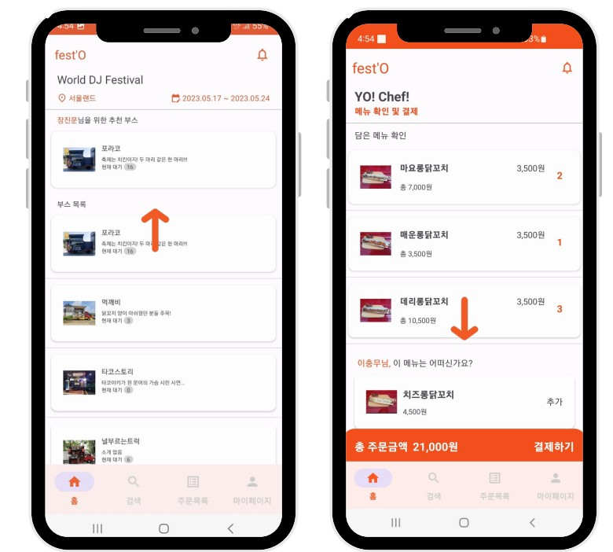
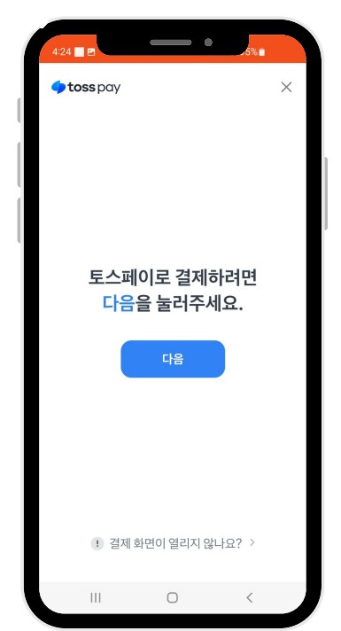
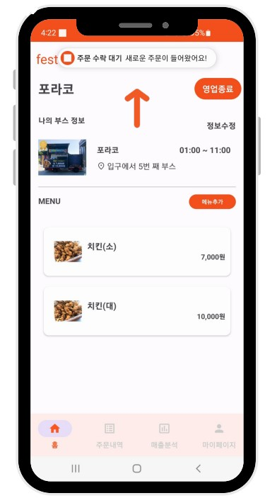
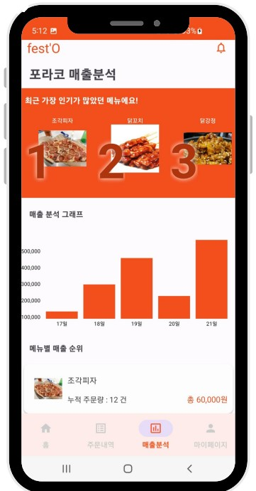

# <b>fest'O</b>


<br />


## 📱 프로젝트 소개
 

[개요] 기다림 없는 축제를 위한 스마트 오더 앱

[기간] 2023.04.10~2023.05.19 (6주)  

[소속] SSAFY 8기 2학기 자율 프로젝트

<br />


## 🏷 기획의도
축제를 즐기고싶은 사용자의 입장에서 더욱 편안하게 축제를 즐길 수 있도록 하는 방법과, 부스의 입장에서 더욱 효율적으로 매출을 관리할 수 있는 방법을 고민하며 만들어졌습니다.
<br />


## 🛠️ 기술 스택 및 환경

BackEnd
- 💥💥💥💥💥

Mobile
- Android Studio
- Kotlin
- Retrofit2
- Google Material Design
- Kakao Login SDK
- Toss Payments SDK

CI/CD
- 💥💥💥💥💥


Data
- 💥💥💥💥💥


<br />


## 💻 아키텍처



<br />


## 📋 요구사항 명세서



<br />


## ✔️ ERD



<br />


## 📁 프로젝트 파일 구조

#### BackEnd
- 💥💥💥💥💥
```
├─gradle
│  └─wrapper
└─src
    ├─main
    │  ├─java
    │  │  └─com
    │  │      └─ssafy
    │  │          └─ododok
    │  │              ├─api
    │  │              │  ├─controller
    │  │              │  ├─dto
    │  │              │  ├─request
    │  │              │  ├─response
    │  │              │  └─service
    │  │              ├─common
    │  │              │  ├─auth
    │  │              │  ├─response
    │  │              │  └─util
    │  │              ├─config
    │  │              └─db
    │  │                  ├─model
    │  │                  └─repository
    │  └─resources
    └─test
        └─java
            └─com
                └─ssafy
                    └─ododok
```

#### Mobile
```
├─app
│  ├─manifest
│  ├─java
│  │ └─com
│  │    └─nowusee
│  │          └─festo
│  ├─res
│
├─Gradle Scripts
```

#### Data
- 💥💥💥💥💥


<br />


## ⭐ 주요 기능 소개

#### 1️⃣ 스마트 오더 및 추천
- 앱에 등록된 축제를 확인하고 축제에 소속되어있는 부스의 목록 및 메뉴정보를 확인할 수 있습니다. 
- 또한 사용자의 활동 기록을 분석하여 부스 및 메뉴를 추천해줄 수 있습니다.


#### 2️⃣ 페이지별 리뷰 작성    
- 주문하고싶은 부스의 메뉴를 담아 간편 결제를 통해 결제할 수 있습니다.  


#### 3️⃣ 알림
- FCM을 활용한 알림 기능을 통해 주문 접수 및 준비 완료와 픽업 완료 등 고객과 부스 운영자에게 알림을 제공할 수 있습니다.


#### 4️⃣ 매출 분석
- 부스 운영자 및 축제 주최측에게는 앱을 통해 주문된 데이터를 기반으로 매출을 분석을 제공해줄 수 있습니다  



<br />


## 🤜 팀원

👩‍💻 김종근 - 팀장, BE 

👨‍💻 이충무 - BE 

👨‍💻 이창민 - 빅데이터 추천      

👨‍💻 장진문 - FE   

👨‍💻 정무남 - FE  

👨‍💻 정채은 - FE  
 


## 📌 Git 사용 규칙
<br/>

### 브랜치 생성, 병합
---
💡 사용 브랜치

- feature - fe_develop에서 feature 분기, 기능 추가 후 fe_develop에 병합
- fe_develop - feature를 병합하기 위해 사용
- main - release 브랜치만 병합
</br></br>


💡 feature 브랜치 생성 및 종료 과정

```bash
// feature 브랜치(feature/login)를 'develop' 브랜치에서 분기
git checkout -b feature/login develop

/* ~ feature 브랜치에서 새로운 기능에 대한 코드 작성 ~ */
git add [작성 파일]
git commit -m "type: Subject"
git push origin feature/login

// 'develop' 브랜치로 이동한다.
git checkout develop

// 'develop' 브랜치에 feature/login 브랜치 내용을 병합(merge)한다.
git merge --no-ff feature/login

// Merging 메시지 입력
i 누르기 (INSERT 모드)
# 무시하고 아래로 이동해서 type: Subject 커밋 메시지 입력
입력 후 esc
:wq + enter

// (삭제 안해도됌) -d 옵션: feature/login에 해당하는 브랜치를 삭제한다.
git branch -d feature/login

// 'develop' 브랜치를 원격 중앙 저장소에 올린다.
git push origin develop
```

</br></br>

###  Commit Convention
---
```
커밋 메시지 양식

type: Subject 설명

ex) 
feat: Add 로그인 유효성 검사 기능
```
</br>

💡 type 규칙
- feat: 새로운 기능 추가
- fix: 버그 수정
- docs: 문서 수정
- style: 코드 포맷 변경, 세미콜론 누락, 코드 변경 없음
- refactor: 프로덕션 코드 리팩터링
- test: 테스트 추가, 테스트 코드 리팩터링, 프로덕션 코드 변경 없음
- chore: 빌드 테스크 업데이트, 패키지 매니저 환경설정, 프로덕션 코드 변경 없음
</br> </br>

💡 Subject 규칙
- 동사(ex. Add, Update, Modify)로 시작
- 첫 글자 대문자
- 끝에 마침표 x

</br></br>
