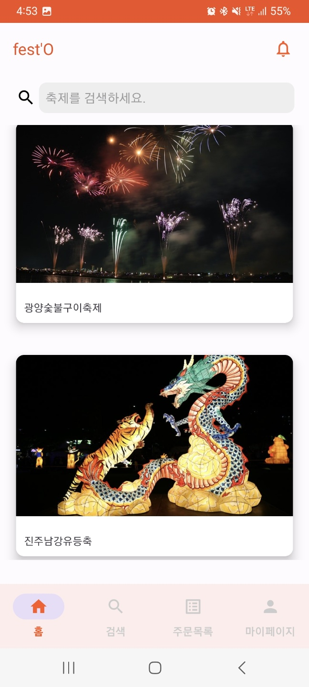
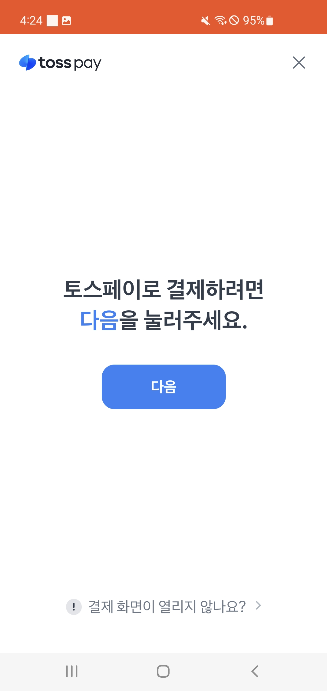
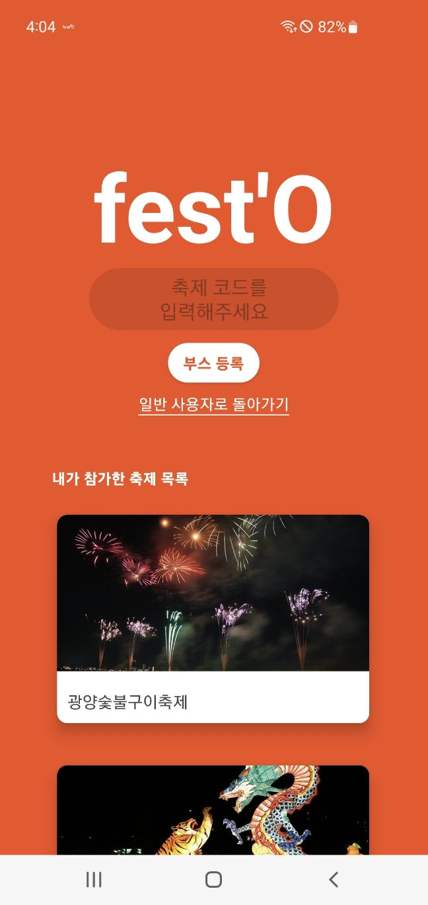
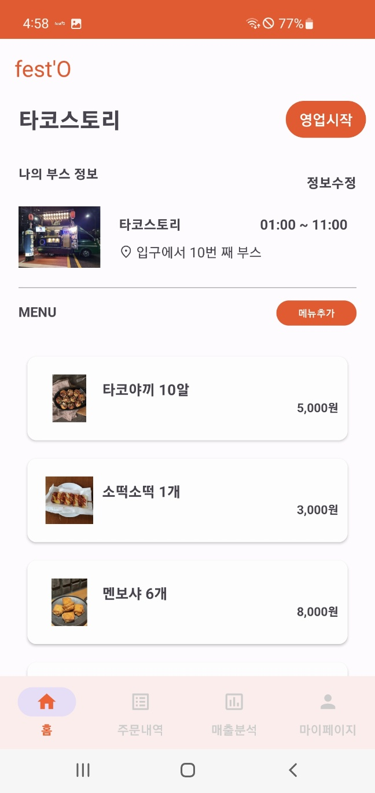
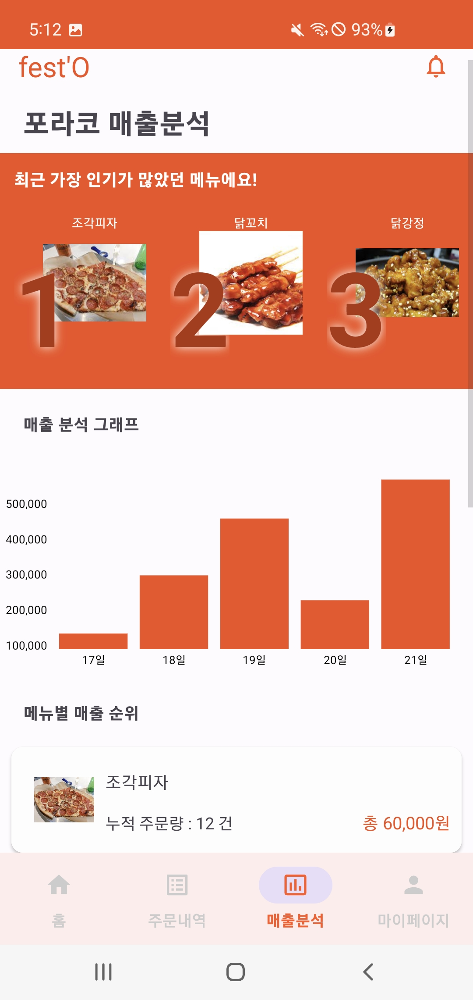

# fest'O 시연 시나리오
## 로그인
---
  

   

- 카카오 로그인을 통해 서비스를 이용할 수 있습니다.

## 일반 사용자
---
  

   

- 로그인을 하면 메인 페이지의 현재 진행중인 축제리스트를 확인할 수 있습니다.
- 메인 화면 안의 검색을 누르거나 하단 네비게이션 바의 검색탭을 눌러 검색 페이지로 이동 및 축제 검색을 할 수 있습니다.

 

   

- 축제를 선택하면 축제에 등록된 부스리스트를 확인할 수 있습니다.
- 리스트 최상단에 사용자 맞춤 추천 부스를 보여줍니다.
- 부스 설명 밑에 사용자를 위한 현재 대기 인원을 보여줍니다.

 

   

- 부스 선택 후 메뉴를 선택할 수 있습니다.
- 메뉴를 선택한 후 결제 준비창에서 주문 금액을 확인할 수 있습니다.
- 결제준비창에선 리스트 하단에 선택한 메뉴와 어울리는 추천 메뉴를 보여줍니다.
- 추천 메뉴의 추가 버튼을 눌러 페이지에서 바로 메뉴를 선택 및 추가할 수 있습니다.
- 결제하기 버튼을 눌러 tosspay에 접속해 결제를 진행할 수 있습니다.

 

   

- 주문내역 및 주문상태를 확인할 수 있습니다.
- 주문 상태에 따른 알림이 노출됩니다.

## 부스 운영자
---
  

   

- 축제코드를 입력해 부스를 등록하거나 이미 등록한 부스를 확인할 수 있습니다.

 

   

- 부스의 정보와 영업상태를 관리할 수 있습니다.
- 메뉴추가를 통해 메뉴를 추가할 수 있습니다.

 

   

- 접수된 주문내역을 확인할 수 있으며, 진행 상황에 따라 상태를 변경해 사용자에게 알림을 보낼 수 있습니다.

 

   

- 가장 인기있는 메뉴 3가지를 상단에서 확인할 수 있습니다.
- 메뉴별 누적 매출액 및 누적 주문건수를 확인할 수 있으며, 일별 매출량을 그래프를 통해 확인할 수 있습니다.
